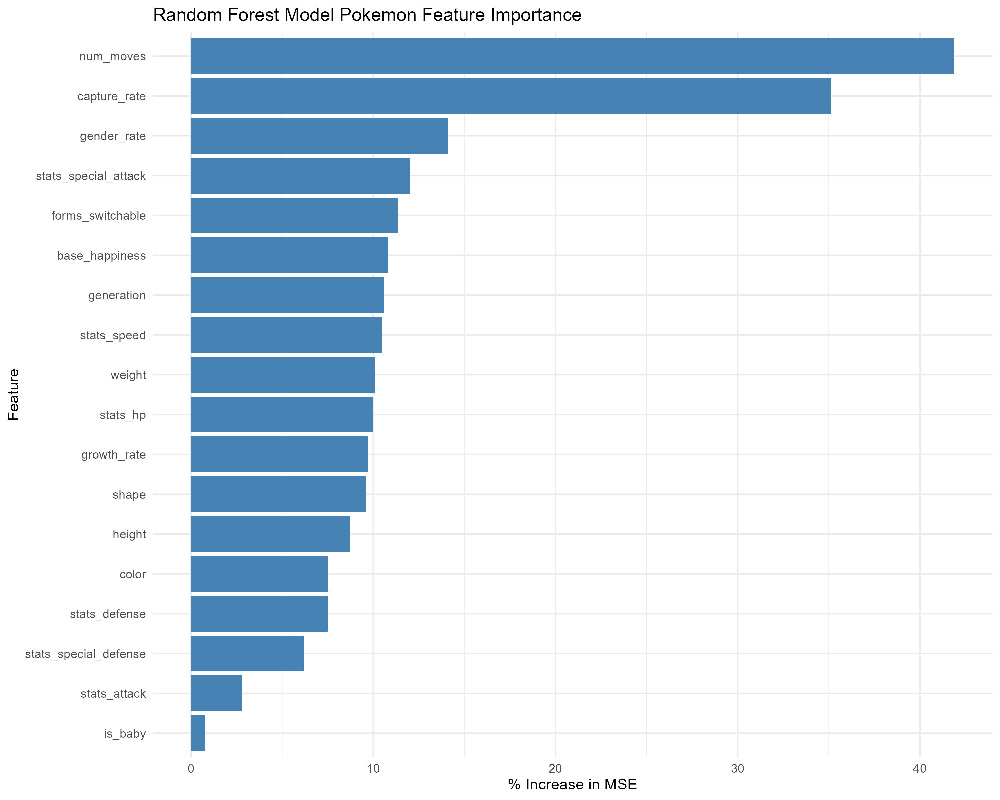
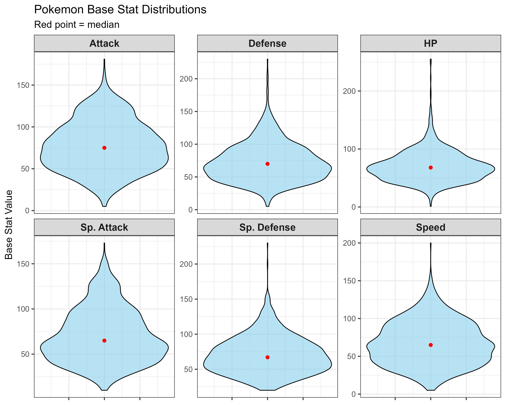
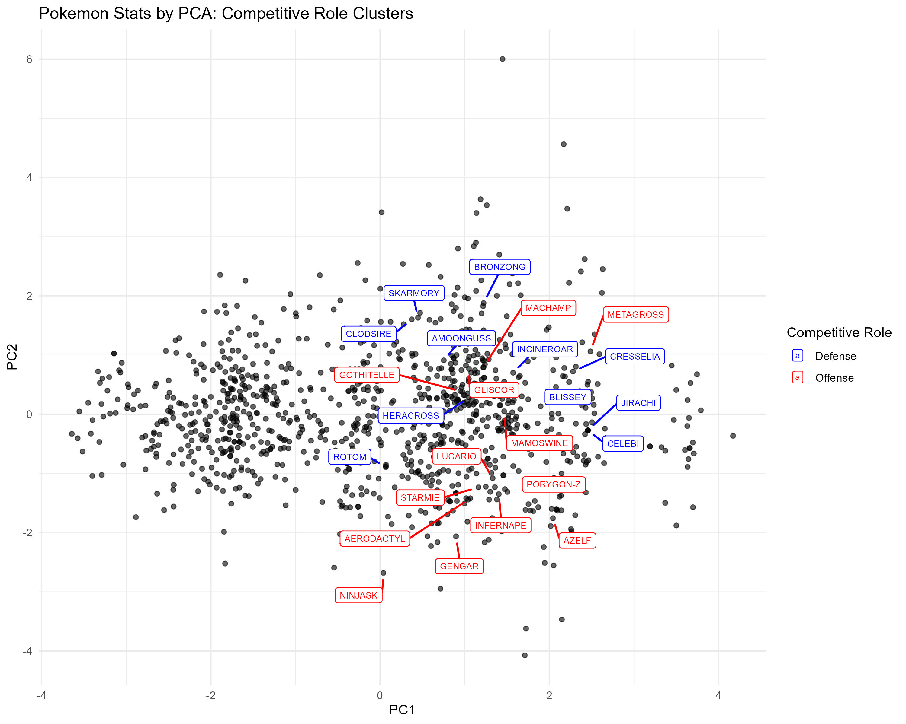
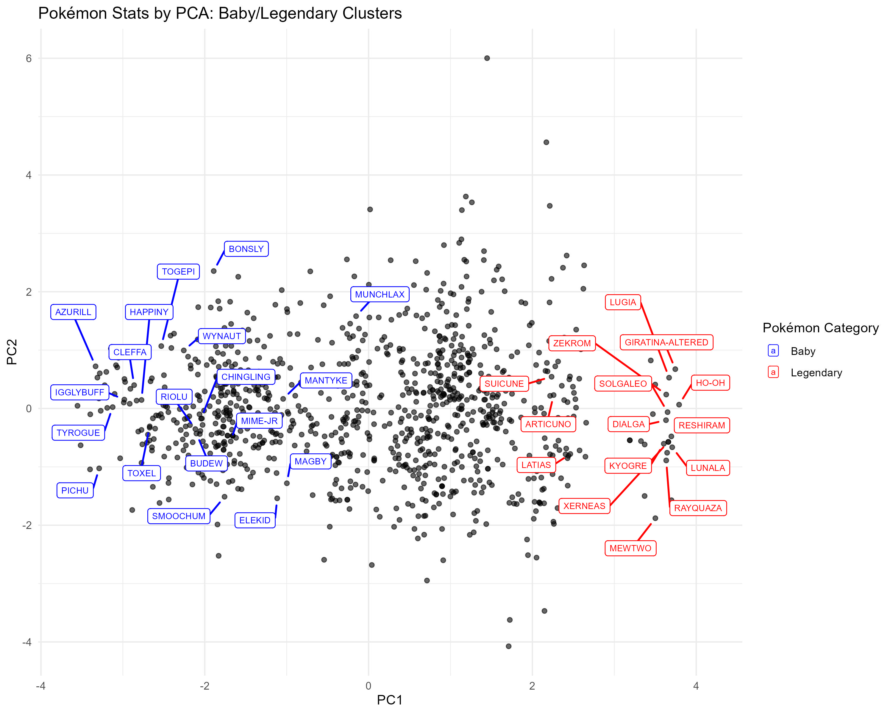

```{r setup, include=FALSE}
knitr::opts_chunk$set(echo = TRUE)
```

## Introduction

For my final BIOS611 project, I elected to attempt to look at trends in Pokemon popularity and try to identify potential competitive team clustering in stat distributions. I grew up with Pokemon Ruby being one of the first games I played once I could learn to read and I was immediately hooked; that interest has certainly waned over a period but I find myself again incredibly curious about Pokemon, with all of the unique facets it contains. There are many complex background equations in all of the Pokemon games, with utility ranging from calculating the probability of hatching a rare shiny Pokemon to competitive training methods. Revisiting Pokemon after a large break, I have used this project as an opportunity to jump start a couple of areas that I have motivation to explore again. First, once I have more time for hobbies following graduation in the Spring semester, I hope to begin attending local competitive events in either the trading card or VGC realm. To begin considering team composition and research, one part of this project aims to use principal component analysis (PCA) with Pokemon stat distributions in order to identify 'meta' clusters for different team lineup choices. Second, I feel that I remember my initial Pokemon endeavors to be relatively similar, with teams rarely deviating over the different generations; no matter what, if there was a Milotic in the game, it would be on the roster. Going forward, I think it would be interesting to challenge my game progression by picking up some of the less popular Pokemon for more diverse gameplay experiences. In attempts to prepare for new undesirable Pokemon introductions in generations yet to come, I have fit general linear fixed effects, lasso regression, and random forest prediction models to estimate a Pokemon's popularity ranking among all currently 1,025 officially released species (not including regional or other special variants). 

At a very high level for those unfamiliar, a Pokemon is fictional animated creature that players can collect, battle, and breed. They can often look familiar to real world animals and popularity widely varies dependent on different factors unique to each individual. The game is played when two players battle against each other with a team of six. The six Pokemon on a team have unique roles, move sets, and abilities that can synergize in impressive ways.  

## Dataset Description 

The data that was used for this project are pulled primarily from two sources. One source is the PokeAPI, which can be accessed at the following URL: 

https://pokeapi.co/

With documentation available at: 

https://pokeapi.co/about

https://pokeapi.co/docs/v2#info

There is a massive array of different Pokemon game data available at this API, including berry information, an encyclopedia of Pokemon moves, and even details on the game maps used across the various generations. For this project, the data import script utilizes the API to obtain key information by Pokemon that I thought may be interesting for the prediction models, in addition to base stat values for PCA. To date, there are 1,025 official Pokemon that represent the observations in the data set. Our initial data import contains fields in addition to the primary features listed below, but it was decided that several of them were not ultimately helpful for either prediction modeling or PCA (list of moves, list of abilities, etc.). Unfortunately, a major limitation of our prediction models will be the exclusion of Pokemon type; with 171 current unique type combinations, it was not feasible to ensure that every combination would be present in both training and testing data splits. For example, only three Pokemon exist with Dark/Fairy typing, and they all come from the same evolution line. Below is a list of the primary features considered for the prediction models and a brief description of each:

1. Pokemon height & weight, typically supplied as in-game lore.
2. Pokemon base stats (health, attack, defense, special attack, special defense, and speed). These stats determine how well a Pokemon can deal damage, take hits, and if they move first. These are the values that will be used for PCA.
3. The rate at which females vs. males within the species are encountered.
4. The probability of catching a wild version of the Pokemon. To obtain a Pokemon team, a player must go out and catch their individual team members. 
5. The baseline happiness level a Pokemon has when you catch it; this is used for some move damage calculations and as a condition for some evolutions.
6. Binary indicators for baby, legendary, or mythical Pokemon. Specially categorized Pokemon are assumed to typically be more popular.
7. The rate of experience gain, or how fast the Pokemon can level up and evolve.
8. Crude categorization of Pokemon color and shape.
9. Binary indicators for differing gender forms or available form switches. Some Pokemon can change depending on game factors.
10. A count of the number of forms that a Pokemon can attain, and a count of the number of moves that a Pokemon can learn. These were not taken from the API, but instead data pre-processing steps in our import program. 

In addition to the PokeAPI data for predictors in our model, we also needed to obtain Pokemon popularity rankings. We elected to use the following website created by 'Thomas Games Docs', who used their YouTube presence to host a popularity ranking vote. Throughout a week of active voting, they obtained over 1.6 million votes directly comparing two randomly selected Pokemon side by side. These votes were used to rank all 1,025 official Pokemon and results were presented at the link below:

https://thomasgamedocs.com/pokemon/

The YouTube video documentation for website creation & data collection is available here: 

https://www.youtube.com/watch?v=MgB7vAdajls

Webscraping methods with R were used to pull the popularity rankings for use in our analyses. The rankings were then merged onto PokeAPI data alongside the import for a final analysis dataset. 


## Prediction Models

```{r echo=FALSE, message=FALSE, warning=FALSE, results='asis'}

library(tidyverse)
library(knitr)

df <- readRDS("Model_Comparisons.rds")
kable(df, caption = "Table 1. Comparison of Prediction Model Performance")

```

Before analyses, the original dataset of 1,025 Pokemon was randomly partitioned into a 75%/25% training/test set split. Table 1. provides a comparison of the three different prediction model types attempted, along with their final model features and Spearman correlation measure. Since we are trying to predict a ranked outcome, correlation between the observed rankings from 'Thomas Games Docs' and the predicted rankings from our models is an appropriate metric for comparison. For the purposes of exploratory analyses and limited data set size, rankings were treated as a continuous outcome for prediction. Overall, Lasso regression performed the best likely due to its ability to select out specific dummy variables from categorical features; this allowed for more selective modeling considering only certain shapes or colors. However, all models show relatively similar correlation values. With the random forest model, we created a feature importance plot to try to gleam some insight on what is primarily driving popularity rankings. The features are ranked on the percentage increase in mean square error that the random forest model achieves when that specific predictor is added to the model vs. when it is not included. Fixed effects that actively increased mean square error in the random forest model were removed before creating the following plot:  

```{r echo=FALSE, out.width='80%', fig.align='center'}


```

Fascinatingly, it appears as though our random forest model shows the number of moves that a Pokemon can learn as the most important feature in estimating its popularity ranking. Perhaps this is indicative of individuals preferring more well-rounded Pokemon that can learn a variety of movesets as opposed to a particular use or role. Maybe unsurprisingly, we see the capture rate or probability of catching the wild Pokemon as the next most important feature; this could likely be linked to rarer Pokemon who may have more of a popular appeal due to their scarcity in the lore. I am also not surprised to see shape and generation ranked highly; many "cute" popular Pokemon take on a similar anatomy similar to house pets, and there is likely a lot of generational nostalgia driving popularity decisions. For example, with generations 3 and 4 as my prime era in the series I am particularly partial to Pokemon from those regions. The last thing I found interesting from this portion of the project was that our binary flags for baby, legendary, and mythical Pokemon appeared to not help the model very much at all, which I would have assumed may be key indicators of popular preference, particularly for legendary and mythical Pokemon (like Mew). 

## Principal Component Analysis

For our second investigation, we will be reviewing if Pokemon base stat distributions are indicative of any sort of competitive team composition clustering. PCA will be performed for the 1,025 Pokemon using health, attack, defense, special attack, special defense, and speed stats. We might expect to see clusters by support/defensive roles (high health, defense, and/or special defense stats) and sweeper/attack roles (high speed, attack, and/or special attack stats). A plot of stat distributions is provided below to get a general sense: 

```{r echo=FALSE, out.width='80%', fig.align='center'}

```

We can already see somewhat similar patterns in how Attack/Special Attack are distributed vs. Defense/Special Defense stats. Generally, most Pokemon hover around moderate, median values in each stat group, but specialized Pokemon and legendaries can greatly skew the more extreme values. For example, Shuckle has an incredible 230 base Defense & Special Defense, but all other base stat values are less than 20. All stats were scaled prior to performing PCA. The plot of primary components 1 and 2 is presented with Pokemon 'role' labels: 

```{r echo=FALSE, out.width='80%', fig.align='center'}

```

With this first set of labels, we have attempted to display just a handful of Pokemon with common defensive and attacking roles as defined by Smogon, a popularly used Pokemon strategy forum  (https://www.smogon.com/dp/articles/pokemon_dictionary). Though we do appear to see somewhat of a trend in how primary components are dominated, there do not appear to be as clear-cut clusters as I was hoping to see. I think that part of the limitation for this analysis was that in hindsight, only the final stage of each evolution line should have been included. Reasonably, you wouldn't expect someone to use a Squirtle or Charmander in a competitive battle when they would just use the Blastoise or Charizard it evolves into instead. Non-final stage Pokemon likely biased this analysis some. In addition, competitive Pokemon team compositions are more complex than simply high defense and high attack party members. For example, Incineroar is classified as a 'defensive' role due to its power to switch into the match safely, but it is also a popular choice for dealing high damage after that switch. This plot, though not particularly useful for identifying playable 'meta' clusters, does still show what we would expect to see in stat distribution clusters. This plot is the same as above, but labels have been given to 'baby' Pokemon and legendary Pokemon that fell within the top 100 most popular rankings: 

```{r echo=FALSE, out.width='80%', fig.align='center'}

```

Here, there is a much more obvious clustering effect; baby Pokemon typically have weaker stats all around, while legendary Pokemon have stats worthy of their title. 

## Conclusions

Pokemon has a huge amount of interesting data and lore that can be analyzed in so many different ways. With this project, we attempted to just scratch the surface a little bit with some exploratory prediction modeling and cluster identification through principal component analysis. As noted, we had some major limitations in both facets of the project. For prediction modeling, some way to better account for Pokemon typing would likely vastly improve the models; I doubt as many people love bug Pokemon that love fire Pokemon, for example. In PCA, identifying a way to filter our data on the final evolution stage could have yielded some more insight that we're currently obscuring. Future analyses could likely take these into account and expand so much further. Imagine even taking data from VGC championship games or other competitive play data to develop models based on team composition, to fill missing roles with the optimized party member. The possibilities are expansive and I look forward to maybe taking this work further for an advantage in the future. 

